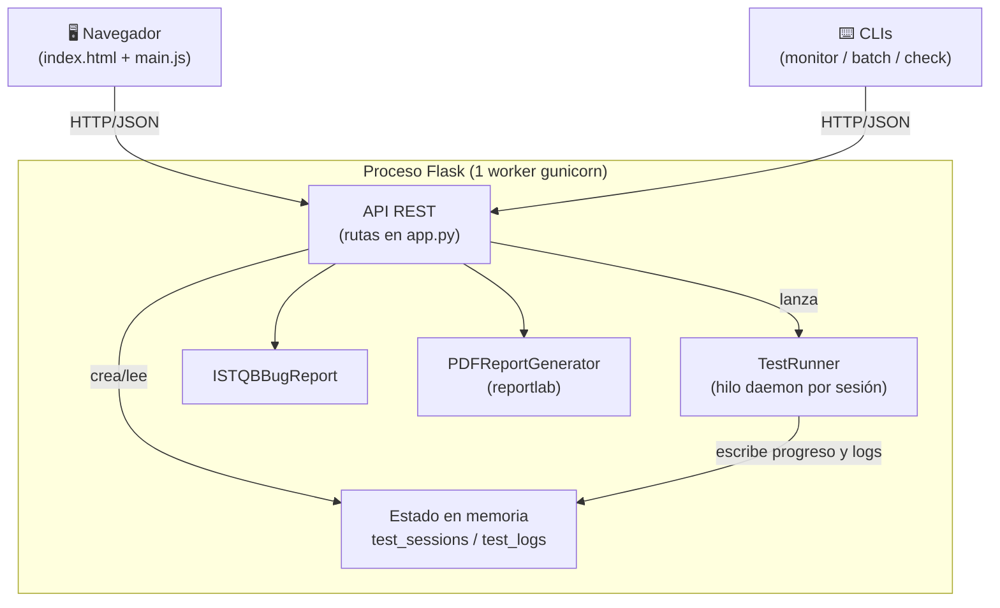
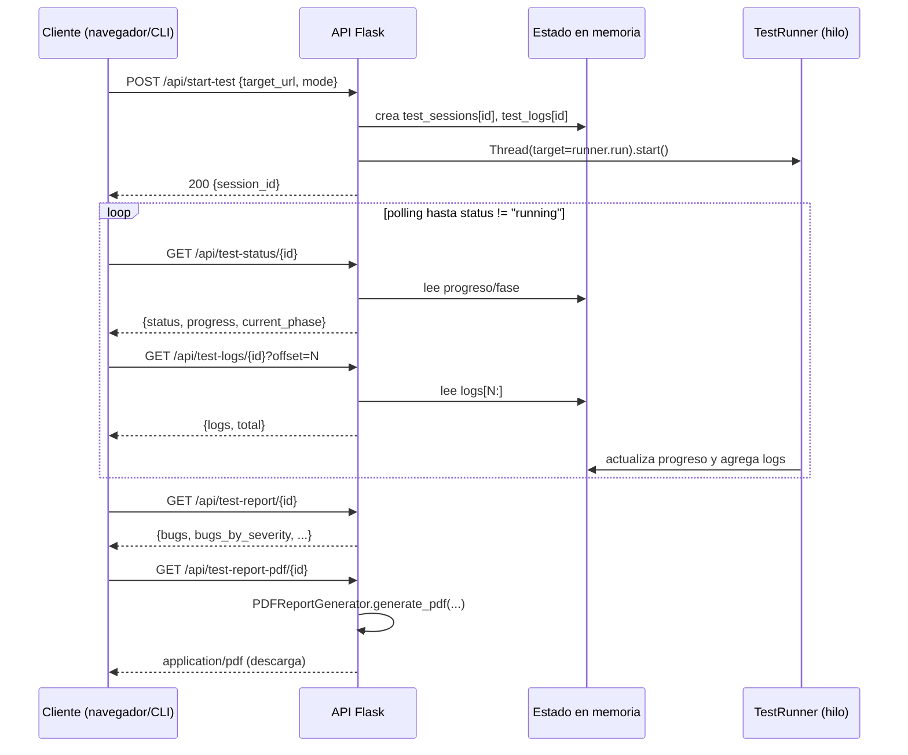
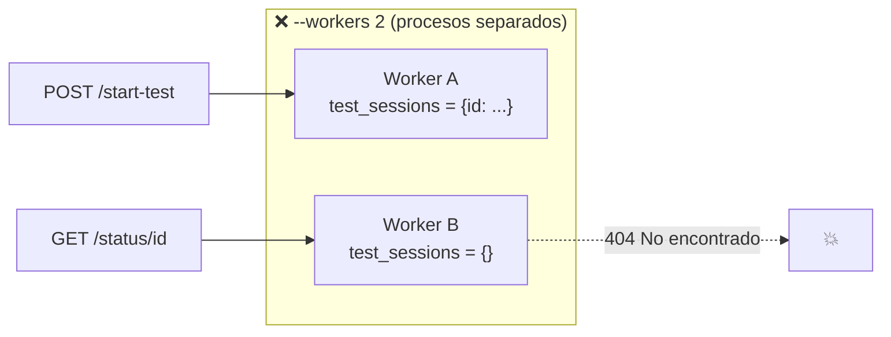

# Documentación técnica — GREENSOFT Testing Framework

Este documento describe la arquitectura interna, el modelo de concurrencia, el flujo de datos, el contrato de la API y los puntos de extensión del proyecto.

> Para instalación y uso, consulta el [README](../README.md).

---

## Tabla de contenidos

- [Visión general](#visión-general)
- [Componentes](#componentes)
- [Flujo de datos](#flujo-de-datos)
- [Modelo de concurrencia](#modelo-de-concurrencia)
- [Modelo de datos](#modelo-de-datos)
- [Contrato de la API](#contrato-de-la-api)
- [Generación de reportes](#generación-de-reportes)
- [Herramientas CLI](#herramientas-cli)
- [Despliegue](#despliegue)
- [Puntos de extensión](#puntos-de-extensión)
- [Limitaciones conocidas](#limitaciones-conocidas)

---

## Visión general

La aplicación es un **monolito Flask** que sirve tanto la interfaz (una SPA ligera en `templates/index.html` + `static/`) como una **API REST** que orquesta sesiones de testing.

El patrón central es **lanzar-y-sondear** (*fire-and-poll*):

1. El cliente hace `POST /api/start-test` y recibe un `session_id`.
2. El servidor lanza el trabajo en un **hilo en segundo plano** y responde de inmediato.
3. El cliente **sondea** (`polling`) `GET /api/test-status/<id>` y `GET /api/test-logs/<id>` para mostrar progreso y logs en vivo.
4. Al terminar, el cliente pide el reporte (`/api/test-report/<id>`) y, opcionalmente, el PDF.



---

## Componentes

| Archivo | Responsabilidad | Notas |
|---|---|---|
| `app.py` | Servidor Flask, rutas de la API, clase `TestRunner` y almacén en memoria | Punto de entrada. |
| `analyzer.py` | **"Manos"**: `SiteAnalyzer` recoge datos reales del sitio (status, headers de seguridad, formularios, accesibilidad, mixed-content) + guard anti-SSRF. | `requests` + `beautifulsoup4`. |
| `agent.py` | **Agente**: `ToolExecutor` expone las manos como tools; `TestAgent` corre el loop de tool-calling donde el LLM decide qué investigar. Devuelve `{bugs, test_cases}`. | Tools fijadas al host + SSRF. |
| `ai_analyst.py` | **Fallback + utilidades**: `AIAnalyst` (análisis single-shot sin tools) y el parseo/normalización compartidos (`parse_findings`, `normalize_bug`, `normalize_test_case`). | Cliente `openai` apuntando a NVIDIA NIM. |
| `istqb_report_generator.py` | Clase `ISTQBBugReport`: normaliza un bug al esquema ISTQB (severidad→prioridad, entorno, pasos, adjuntos…). | Modelo de datos de defectos. |
| `pdf_generator.py` | Clase `PDFReportGenerator`: arma el PDF con `reportlab` (portada, resumen, tabla por bug). | Estilo de marca Greensoft (`#00ff99`). |
| `templates/index.html` | Dashboard de una sola página. | Servida por la ruta `/`. |
| `static/js/main.js` | Lógica de cliente: inicia tests, hace polling, renderiza progreso/logs/reporte. | |
| `static/css/style.css` | Estilos del dashboard. | |
| `monitor.py`, `batch_test.py`, `check_server.py` | Clientes de línea de comandos sobre la misma API. | Útiles para automatización/CI. |

### Anatomía de `TestRunner` (`app.py`)

Cada sesión instancia un `TestRunner(session_id, target_url, mode)` que se ejecuta en su propio hilo. Su método `run()` ejecuta dos etapas:

1. **Recolección (15%)** — `SiteAnalyzer().collect(url)` obtiene los hechos del sitio. Si la URL es interna lanza `SSRFError` (sesión → `error`); si el sitio no responde, eso mismo se registra como un bug `CRITICAL`.
2. **Análisis con IA (55% → 100%)** — `AIAnalyst().analyze(facts)` devuelve los bugs. Si no hay `NVIDIA_API_KEY` o la llamada falla, se hace **fallback** a `_simulated_bugs()` para que la demo no se rompa.

Métodos auxiliares:
- `add_log(message, level)` — agrega una línea con timestamp y la sincroniza con `test_logs[session_id]`.
- `update_progress(progress, phase)` — actualiza `test_sessions[session_id]`.
- `_finish(status)` — persiste `bugs` y estado final en la sesión.

> El parámetro `mode` (`quick`/`standard`/`deep`) hoy modula la narrativa de progreso; profundizar el análisis por modo (p.ej. crawl multi-página en `deep`) está en el [roadmap](../README.md#-roadmap).

---

## Flujo de datos



El parámetro `offset` en `/api/test-logs` permite **streaming incremental**: el cliente solo pide las líneas nuevas desde la última que ya tiene.

---

## Modelo de concurrencia

Este es el aspecto más delicado del sistema y condiciona el despliegue.

- **Estado compartido en memoria.** `test_sessions` y `test_logs` son diccionarios globales del proceso. No hay base de datos.
- **Un hilo por sesión.** `POST /api/start-test` lanza un `threading.Thread(daemon=True)`. Como es *daemon*, no bloquea el cierre del proceso.
- **El servidor de producción DEBE correr con un solo worker.**

```bash
gunicorn app:app --workers 1 --threads 8 --timeout 120 --bind 0.0.0.0:$PORT
```

¿Por qué?



Con varios *workers*, cada proceso tiene **su propia copia** de los diccionarios. La petición de inicio podría atender el Worker A (que guarda la sesión) y el sondeo de estado podría caer en el Worker B (que no la tiene) → `404`.

La solución correcta es **1 worker + varios hilos**:
- `--workers 1`: un único proceso, un único almacén en memoria coherente.
- `--threads 8`: el worker atiende varias peticiones HTTP concurrentes (el sondeo de status/logs no se bloquea mientras el hilo del test trabaja).

> Si en el futuro necesitas escalar horizontalmente (varios workers o varias instancias), primero hay que **externalizar el estado** a Redis o una base de datos. Ver [Roadmap](../README.md#-roadmap).

---

## Modelo de datos

### Sesión (`test_sessions[session_id]`)

```json
{
  "session_id": "a1b2c3d4",
  "target_url": "https://example.com",
  "mode": "standard",
  "status": "running",          // running | completed | cancelled | error
  "progress": 60,                // 0–100
  "current_phase": "Análisis de APIs",
  "start_time": "2026-06-14T17:00:00"
}
```

El `session_id` es los primeros 8 caracteres de un `uuid4`.

### Logs (`test_logs[session_id]`)

Lista de cadenas con formato `[HH:MM:SS] NIVEL: mensaje` (niveles: `INFO`, `SUCCESS`, `ERROR`).

### Defecto en formato ISTQB (`ISTQBBugReport`)

`ISTQBBugReport.add_bug()` normaliza cada bug a un esquema completo: `bug_id`, `title`, `summary`, `environment` (browser/os/test_data/network), `severity`, `priority` (mapeada desde la severidad), `type`, `status`, `steps_to_reproduce`, `expected_result`, `actual_result`, `attachments`, `services_affected`, `impact`, etc.

Mapeo severidad → prioridad:

| Severidad | Prioridad |
|---|---|
| `CRITICAL` | P1 - INMEDIATA |
| `HIGH` | P2 - URGENTE |
| `MEDIUM` | P3 - NORMAL |
| `LOW` | P4 - BAJA |

---

## Contrato de la API

Todas las respuestas son JSON salvo el PDF. Errores devuelven `{ "error": "mensaje" }` con el código HTTP correspondiente.

### `POST /api/start-test`
- **Body:** `{ "target_url": "http(s)://...", "mode": "quick" | "standard" | "deep" }`
- **200:** `{ "session_id": "a1b2c3d4" }`
- **400:** la URL no empieza por `http://` o `https://` → `{ "error": "URL inválida" }`

### `GET /api/test-status/<session_id>`
- **200:** `{ session_id, status, progress, current_phase }`
- **404:** sesión inexistente.

### `GET /api/test-logs/<session_id>?offset=N`
- **200:** `{ "logs": [...], "total": N }` — `logs` contiene las líneas desde `offset`.
- **404:** sesión inexistente.

### `GET /api/test-report/<session_id>`
- **200:** `{ session_id, target_url, mode, status, total_bugs, bugs_by_severity, bugs[], deployment_recommendation }`
- **404:** sesión inexistente.

### `GET /api/test-report-pdf/<session_id>`
- **200:** `application/pdf` como adjunto (`report-<id>.pdf`).
- **404 / 500:** sesión inexistente o error generando el PDF.

### `GET /api/features`
- **200:** lista de las 8 áreas: `[{ id, name, icon }, ...]`.

### `POST /api/cancel-test/<session_id>`
- **200:** `{ "status": "ok" }` — marca la sesión como `cancelled`.

### `POST /api/clear-history`
- **200:** `{ "status": "ok" }` — vacía `test_sessions` y `test_logs`.

---

## Generación de reportes

`PDFReportGenerator.generate_pdf(filename, session_id, target_url, mode, bugs)` produce un PDF A4 con `reportlab`:

1. **Portada / header** con título e identidad Greensoft.
2. **Tabla de sesión** (proyecto, URL, session_id, modo, fecha).
3. **Resumen ejecutivo** con conteo por severidad.
4. **Una sección por bug**: encabezado coloreado por severidad + tabla de detalle (descripción, esperado, actual, impacto, servicios).

> Nota de implementación: la ruta `/api/test-report-pdf` genera el PDF en un archivo temporal, lo lee a memoria (`BytesIO`) y borra el temporal antes de responder. Es un *workaround* funcional; una mejora futura es que `generate_pdf` escriba directamente a un buffer en memoria.

---

## Herramientas CLI

Las tres son clientes HTTP de la misma API (`API_URL = http://localhost:5000`):

- **`check_server.py`** — verifica salud: hace `GET /` y `GET /api/features`, reintenta hasta 5 veces.
- **`monitor.py <url> [modo]`** — inicia una sesión y muestra progreso + logs en vivo con códigos de color por severidad, luego imprime el reporte.
- **`batch_test.py`** — recorre una lista de URLs (`URLS`), ejecuta cada una, agrega resultados en una tabla resumen y guarda `batch_report_<timestamp>.json`.

Estas herramientas son la base natural para integrar el framework en **CI** (por ejemplo, fallar el build si aparecen bugs `CRITICAL`).

---

## Despliegue

Definido como código en [`render.yaml`](../render.yaml):

```yaml
services:
  - type: web
    name: greensoft-testing
    runtime: python
    plan: free
    buildCommand: pip install -r requirements.txt
    startCommand: gunicorn app:app --workers 1 --threads 8 --timeout 120 --bind 0.0.0.0:$PORT
```

- El puerto se lee de la variable de entorno `PORT` (inyectada por Render) tanto en `app.run` (desarrollo) como vía `--bind` en gunicorn (producción).
- **IA:** se activa con la env var `NVIDIA_API_KEY` (y opcionalmente `NVIDIA_MODEL`) en el dashboard de Render. Sin ella, modo demo.
- Redeploy automático en cada push a la rama por defecto.
- **Plan free:** el servicio se suspende tras ~15 min sin tráfico (arranque en frío al volver) y, al reiniciarse, **se pierde el estado en memoria**.

---

## Integración con el LLM (NVIDIA NIM)

Ambos modos usan el SDK `openai` apuntando al endpoint compatible de NVIDIA:

- **base_url:** `https://integrate.api.nvidia.com/v1`
- **modelo por defecto:** `z-ai/glm-5.1` (configurable con `NVIDIA_MODEL`)
- **salida:** objeto JSON `{bugs, test_cases}` (contrato en `OUTPUT_CONTRACT`).
- **parseo defensivo:** `parse_findings()` → `_extract_json_object()` intenta (1) `json.loads` directo, (2) bloque ``` ```json ```, (3) del primer `{` al último `}`. Si falla, lanza y se cae al siguiente nivel de fallback.
- **normalización:** `normalize_bug()` y `normalize_test_case()` validan severidad/status y añaden campos de compatibilidad.

### Modo agente (`TestAgent`, principal)

Loop de tool-calling: se envían `TOOL_SCHEMAS` al modelo; mientras devuelva `tool_calls`, `ToolExecutor` las ejecuta y se devuelven los resultados como mensajes `role: tool`; cuando el modelo responde sin tools, esa respuesta es el reporte final.

- **Tools:** `get_overview`, `get_security_headers`, `get_forms`, `get_page_meta` (leen los hechos ya recogidos), `discover_endpoints` y `fetch_path` (hacen fetch nuevo).
- **Seguridad:** `ToolExecutor._same_host_url()` fija toda petición al host original y aplica el guard anti-SSRF. Un LLM eligiendo URLs es un vector SSRF nuevo; aquí se cierra.
- **Rate limit (40 rpm):** `MAX_ITERATIONS = 6`; al alcanzarlo se fuerza una última llamada **sin tools** que sintetiza el reporte (garantiza terminación).

### Cadena de fallback

`TestRunner._run_ai()`: **agente** (tool-calling) → **single-shot** (`AIAnalyst.analyze`, 1 llamada) → **simulado** (datos de ejemplo). Cada salto se registra en los logs. Así un fallo de tool-calling, un 429 o la ausencia de key nunca rompen la demo.

> Razones de diseño: modelo *instruct/agéntico* (no *reasoning* ni *omni*) para JSON limpio; el parseo defensivo cubre respuestas envueltas en texto.

## Puntos de extensión

- **Tool-calling agéntico:** en vez de una sola llamada, dar al LLM herramientas (`fetch_page`, `check_headers`, `probe_form`…) y dejar que decida en un loop. Sube de "cerebro analista" a "agente autónomo".
- **Navegador real:** integrar Selenium/Playwright en `analyzer.py` para sitios con JS pesado y pruebas de UI reales.
- **Profundidad por modo:** que `deep` haga crawl multi-página y más llamadas al LLM (cuidando el límite de 40 rpm).
- **Persistencia:** sustituir los diccionarios en memoria por Redis/SQLite para sobrevivir reinicios y habilitar múltiples workers.
- **JIRA:** en `ISTQBBugReport`, añadir un método que cree issues vía la API de JIRA.
- **Formatos de reporte:** añadir export HTML/CSV junto al PDF existente.

---

## Limitaciones conocidas

1. **Análisis estático (sin navegador)** — `analyzer.py` usa `requests`, no ejecuta JS; sitios SPA pesados se ven parcialmente. Selenium/Playwright está en el roadmap.
2. **Estado volátil** — todo vive en memoria; un reinicio borra sesiones y reportes. Persistencia (Postgres) en el roadmap.
4. **Un solo worker** — no escala horizontalmente hasta externalizar el estado.
5. **Sin autenticación** — cualquiera con la URL puede lanzar tests; el guard anti-SSRF mitiga el abuso de red, pero no exponer sin proteger.
6. **PDF vía archivo temporal** — funciona, pero conviene migrar a buffer en memoria.
7. **Rate limit** — tier gratuito de NVIDIA: 40 req/min.
